# AI-LAB2实验报告

**PB18111757 陈金宝**

## 实验环境

```
python 3.9.2
pytorch 1.8.1
cuda 11.1
```

## LinearClassfication

对于线性分类器，分类函数为$f(x) = wX+b = h_w(x)$,损失为$Loss(w)=(y - h_w(x))^2$。

加上L2正则化后，损失为$Loss(w)=(y - h_w(x))^2 + \lambda||w||^2$

对$w$的每个分量沿着梯度下降更新。即:
$w_i= w_i- lr\frac{\partial }{\partial w_i}Loss(w)$ 。其中

$\frac{\partial }{\partial w_i}Loss(w)= \frac{\partial}{\partial w_i}((y - h_w(x))^2 + \lambda w_i ^ 2) \\=2(y -h_w(x))\times \frac{\partial}{\partial w_i}(y - h_w(x)) + 2\lambda w_i \\=-2(y - h_w(x))\times x_i + 2\lambda w_i$。

将上式中的系数2并入学习率中，得到梯度下降公式:

$w_i = w_i + lr((y -h_w(x_i))\times x_i - \lambda w_i)$

上述是对单个训练样例的情况。
针对N个样例时，更新的公式为

$w_i = w_i +lr\sum_j(y_j-h_w(x_j))\times x_j^i - lr\times\lambda w_i$

同理可得b的更新公式为

$b = b +lr\sum_j(y_j-h_w(x_j)) - lr\times\lambda b$

以上述公式为原理实现线性分类器。

由于要分三类，所以实现3个线性分类器（手动将标签变为1，0）。

每次迭代过程中由于需要将三千多个样本进行梯度求和，会出现梯度爆炸的情况。为避免梯度爆炸，可采用求平均或将梯度归一化。

实现时采用归一化的方式。将梯度除以它的二范数，之后再进行更新。以分量的形式对参数进行更新

```python  
    ...
for i in range(self.epochs):
    grad = self.Dloss(k)#求梯度
    ts = torch.tensor(grad)
    ts = ts / ts.norm(p=2)#梯度归一化
    print("loop{}:\nbefore:{}".format(i, str(self.param[k])))
    for j in range(self.dim+1):
        self.param[k][j] = self.param[k][j] + self.lr * ts[j].item()
    print("after :{}".format(str(self.param[k])))
    ...
```

预测时则比较三个线性预测器的分数，取最高的作为预测结果

```python
def predict(self, test_features):
    ''''
    需要你实现的部分
    '''
    test_len = len(test_features)
    out = np.empty(shape=(test_len, 1), dtype=int)
    for i in range(test_len):
        pred = []
        for j in range(3):
            pred_raw = (self.targetmul(test_features[i], j))
            pred.append(pred_raw)
        pred_final = pred.index(max(pred)) + 1
        print("test_case[{}]:res:{},pred:{}".format(i, str(pred), pred_final))
        out[i] = pred_final
    return out
```

最后的运行结果：

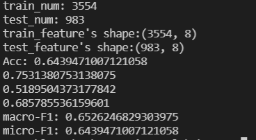

## nBayesClassifier

采用朴素贝叶斯模型。对于离散型的数据，采用如下形式：

$P(c) = \frac{|D_c|+1}{|D|+|N|},P(x_i|c) = \frac{|D_{c，x_i|}+1}{|D_c|+|N_i|}$

对于连续型数据，根据样本计算其方差和均值。假设其遵循高斯分布:

$f(x)=\frac{1}{\sigma \sqrt{2 \pi}}e^{-\frac{(x-\mu)^2}{2\sigma^2}}$

对输入数据进行统计，将计算出的先验概率和条件概率（或均值、方差）存放在字典Pc,Pxc中。

在实现中：

对于离散型数据,$self.Pxc[c][i][x] = P(x_i|c)$

对于连续数据，$self.Pxc[c][i] = (\mu,\sigma^2)$（即存放的是$f(x_i|c)$对应高斯分布的均值和方差）

在预测时，基于以下公式:
$h_{nb}(x)=argmax_{c\isin Y}P(c)\Pi_i^dP(x_i|c)$

对于连续型数据，用计算出的概率密度来代替概率。概率(密度)乘积最大的label即为预测的结果。

计算时对概率取对数，防止出现0的情况

```python
def predict(self, features, featuretype):
        '''
        需要你实现的部分
        '''
    test_len = len(features)
    out = np.empty(shape=(test_len, 1), dtype=int)
    for index in range(test_len):
        cur_data = features[index]
        maxP = float("-inf")
        predict_label = 0
        for label in self.Labels:
            #prob = 1.0
            prob = 0.0
            for i in range(self.dim):
                if featuretype[i] == 0:
                    #prob = prob * self.Pxc[label][i][cur_data[i]]
                    prob = prob + math.log(self.Pxc[label][i][cur_data[i]])
                else:
                    avg, var = self.Pxc[label][i]
                    #prob = prob * self.gauss_prob(avg, var, cur_data[i])
                    prob = prob + math.log(self.gauss_prob(avg, var, cur_data[i]))
            if prob >= maxP:
                predict_label = label
                maxP = prob
        out[index] = predict_label
        #print("test data {},prob={},label={}".format(index, maxP, predict_label))
    return out
```

最后的运行结果:

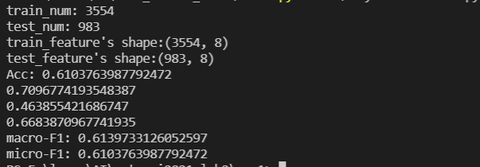

## SVM

SVM 需要优化的目标函数为：

$\min w^Tw \space subject \space to \space 1-y_i(w^Tx_i+b) \leq 0,\forall i$

采用拉格朗日乘子法，得

$L(w,b,\alpha)=\frac{1}{2}w^Tw-\sum_{i=1}^n \alpha_i[y_i(w^Tx_i+b)-1]$

原问题可转化为

$\min_{w,b}\max_{\alpha \geq0}L(w,b,\alpha)$

上述问题最终可转化为

$\max_\alpha \sum_{i=1}^n \alpha_i - \frac{1}{2}\sum_{i,j=1}^n\alpha_i \alpha_j y_i y_j(x_i^Tx_j) \space \\ subject \space to \space \alpha_i \geq 0,\forall i,\sum_{i=1}^n \alpha_i y_i = 0$

在实现中，通过`cvxpy`解上述优化问题。

```python
import cvxpy as cp
...
lagrange = cp.Variable(shape, pos=True)
res = self.kernel_matmul(train_label * train_data, (train_label * train_data).transpose(), kernel=self.kernel)
obj = cp.Maximize(cp.sum(lagrange) - (1 / 2) * cp.quad_form(lagrange, res))
const = [lagrange >= self.Epsilon, lagrange <= self.C, cp.sum(cp.multiply(lagrange, train_label)) == 0.0]
problem = cp.Problem(obj, const)
res_final = problem.solve()
...
```

再根据解出的$\alpha$复原出$w$：

```python
self.param['w'] = np.sum(lagrange.value * train_label * train_data, axis=0)
```

再根据支持向量来复原$b$：

```python
for i in range(lagrange.value.shape[0]):
    if lagrange.value[i] > self.Epsilon:
        self.param['b'] = train_label[i] - np.dot(self.param['w'].T, train_data[i])
        break
```

预测时根据参数$w,b$返回预测的分数

最终的结果：

采用Gauss核时：

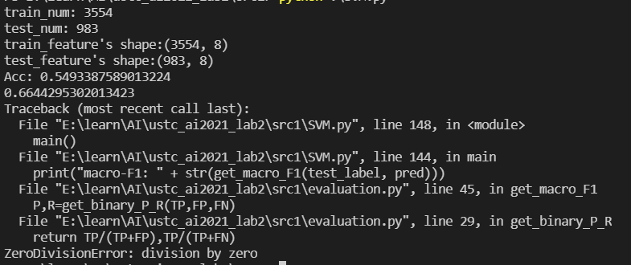

此时出现除零错误，应该有一类未分进去

采用Linear核时:

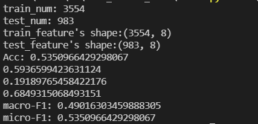

采用Poly核时:

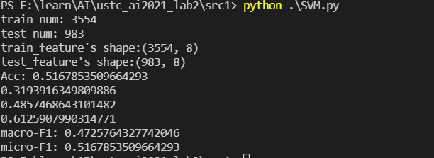

发现进行高斯核计算时有除零错误，尝试进行改进。首先将限制条件改为
```python
const = [lagrange >= 0.0, lagrange <= self.C, cp.sum(cp.multiply(lagrange, train_label)) == 0.0]
```
求解完后将小于epsilon的$\alpha$设为0。
```python
res_final = problem.solve()
lag_value = lagrange.value
for i in range(lagrange.value.shape[0]):
    if lag_value[i] < self.Epsilon:
        lag_value[i] = 0.0
```
之前求解b只使用了一个支持向量的值。现在改为对所有支持向量求均值

```python
total_sv = 0
total_b = 0.0
for i in range(lagrange.value.shape[0]):
    if lag_value[i] > 0.0:
        total_sv += 1
        total_b += (train_label[i] - np.dot(self.param['w'].T, train_data[i]))
        
self.param['b'] = total_b / total_sv
```
改进后的高斯核结果如下:

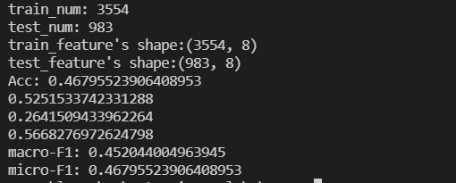

此时不再有除零错误

且发现此时使用线性核时，正确率也有明显提升:

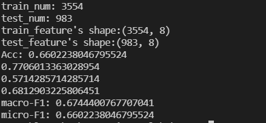

综上可得改进是较为有效的改进。

## MLP_manual

损失函数使用交叉熵，即$l=-y^T\lg h$  ($y$为label,$h$为最后一层输出)

微分得:$dl=-y^T(\frac{1}{h}dh)$

向量化后得:$vec(dl)=-y^Tdiag(\frac{1}{h})vec(dh)$

得:$\frac{\partial l}{\partial h}=-diag(\frac{1}{h})y$

激活函数取softmax，则$h=softmax(z)$

则$vec(dh)=diag(h)vec(dz)-hh^Tvec(dz)$

则$\frac{\partial h}{\partial z}=diag(h)-hh^T$

所以可得$-(diag(h)-hh^T)diag(\frac{1}{h})y\\=h(1^Ty)-y=h-y$

所以输出层$\delta=f'(z)(h-y)$

再结合实验文档给出链接中的推导，可得下式（即使用交叉熵或MSE时$\delta$的形式是一样的）：

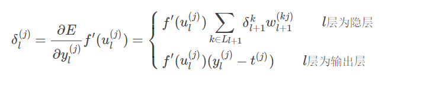

最终的更新公式：

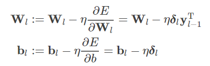

实现时对每一组数据，先进行前向传播得到各层输出。再根据输出和label进行反向传播，更新参数。

前向传播:

```python
def FP(self, mlp_in):
    all_out = [mlp_in]
    for index in range(len(self.W)):
        all_out.append(sigmoid(self.W[index] * all_out[-1] + self.b[index]))
    all_out[-1] = softmax(all_out[-1])
    return all_out
```

反向传播时计算$\delta$，并计算梯度且更新。返回loss和梯度:

```python
def BP(self, label, all_out):
    delta = []
    label = label.reshape(all_out[-1].shape)
    one = np.ones(shape=all_out[-1].shape, dtype=float)
    out_delta = np.multiply((all_out[-1] - label), np.multiply(all_out[-1], (one - all_out[-1])))
    delta.append(out_delta)
    W_grad = []
    b_grad = []

    for i in range(len(self.W) - 1):
        derivative = dsigmoid(all_out[-2 - i])
        cur_delta = np.multiply(self.W[-i - 1].T * delta[-1], derivative)
        delta.append(cur_delta)

    for i in range(len(delta)):
        cur_w_grad = (delta[i] * all_out[-2 - i].T)
        W_grad.insert(0, cur_w_grad)
        cur_b_grad = delta[i]
        b_grad.insert(0, cur_b_grad)
        self.W[-i - 1] = self.W[-i - 1] - self.lr * cur_w_grad
        self.b[-i - 1] = self.b[-i - 1] - self.lr * cur_b_grad

    ln = np.log(all_out[-1])
    loss = -np.dot(label.T, ln)
    return loss, W_grad, b_grad
```

记录每次更新时的梯度和loss，可用于最后的绘图以及与torch自动求解梯度相比较。

取lr=0.05,epochs=100，最后得到下图:

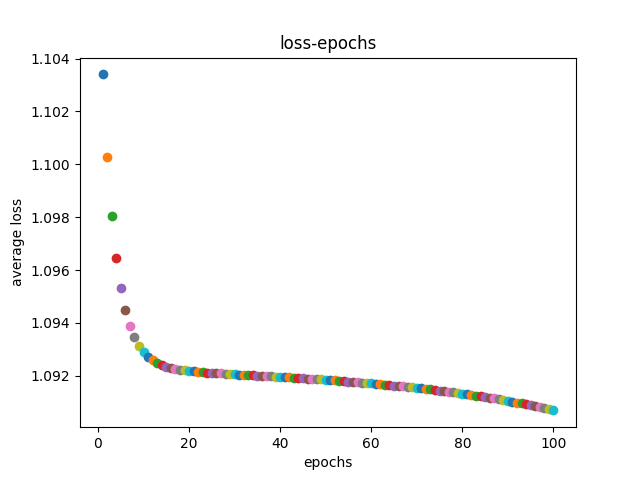

与自动梯度相比较时，在fit时设置compare=True，会计算自动梯度和手动梯度之间夹角的余弦值并打印。设置show=True会输出每一轮的loss

```python
...
mlp = MLP()
mlp.fit(train_data, train_label, show=True, compare=True)
...
```

使用torch自动计算梯度并返回:

```python
def torch_grad(self, x, y):
    x = torch.tensor(x)
    y = torch.tensor(y)
    # y = y.reshape((y.shape[0], 1))
    all_out = [x]
    W = []
    b = []
    for item in self.W:
        item_tensor = torch.tensor(item)
        W.append(item_tensor)
        W[-1].requires_grad = True
    for item in self.b:
        item_tensor = torch.tensor(item)
        b.append(item_tensor)
        b[-1].requires_grad = True
    for index in range(len(W)):
        res = torch.sigmoid(torch.matmul(W[index], all_out[-1]) + b[index])
        all_out.append(res)
    all_out[-1] = torch.softmax(all_out[-1], dim=0)
    ln = -torch.log(all_out[-1])
    ln = ln.reshape((ln.shape[0]))
    loss = torch.dot(y.T, ln)
    loss.backward()
    W_grad = []
    b_grad = []
    for i in range(len(W)):
        W_grad.append(W[i].grad)
        b_grad.append(b[i].grad)
    return W_grad, b_grad
```

计算自动梯度和手动梯度的夹角并打印：
```python
...
    torch_w_grad, torch_b_grad = self.torch_grad(cur_data.T, cur_label)
    cur_loss, cur_w_grad, cur_b_grad = self.BP(cur_label, tmp)
    all_loss.append(float(cur_loss))
    cos = torch.nn.CosineSimilarity(dim=0)
    if compare:
        for j in range(len(torch_w_grad)):
            print(cos(torch.tensor(cur_w_grad[j]).reshape(-1,), torch_w_grad[j].reshape(-1,)))
...
```
部分输出如下图：


可看出自动梯度与手动梯度之间夹角的余弦非常接近1，即夹角几乎为0。所以可得手动梯度与自动梯度方向是基本相同的。

## MLP_Mixer

实现的MLP_Mixer中不使用卷积。

Pre-patch Fully-connected使用nn.Linear实现

LayerNorm使用nn.LayerNorm。
MixLayer中的两个MLP中的每一个中的Fully Connected也均使用nn.Linear，GELU使用nn.GELU:

```python
def __init__(self, patch_size, hidden_dim):
    super(Mixer_Layer, self).__init__()
    ########################################################################
    # 这里需要写Mixer_Layer（layernorm，mlp1，mlp2，skip_connection）
    self.norm1 = nn.LayerNorm(hidden_dim)
    self.norm2 = nn.LayerNorm(hidden_dim)
    self.mlp1 = nn.Sequential(
        nn.Linear((28 // patch_size) ** 2, (28 // patch_size) ** 2),
        nn.GELU(),
        nn.Linear((28 // patch_size) ** 2, (28 // patch_size) ** 2),
    )
    self.mlp2 = nn.Sequential(
        nn.Linear(hidden_dim, hidden_dim),
        nn.GELU(),
        nn.Linear(hidden_dim, hidden_dim),
    )
    ...
```

Skip Connection在forward中实现：

```python
def forward(self, x):
    ########################################################################
    x1 = self.norm1(x)
    mixed_token = self.mlp1(x1.transpose(-2, -1))
    x = x + mixed_token.transpose(-1, -2)
    ########################################################################
    x2 = self.norm2(x)
    mixed_channel = self.mlp2(x2)
    return x + mixed_channel
```

最后求解均值使用torch.mean。Fully Connected使用nn.Linear

数据在输入模型前需要先按patch_size进行分割:

```python
rows = data.split(self.patch_size, dim=2)
columns = [row.split(self.patch_size, dim=3) for row in rows]
patch_data = [torch.stack(column, dim=2) for column in columns]
input_data = torch.cat(patch_data, dim=2)
input_data = input_data.reshape(
            (input_data.shape[0], input_data.shape[1], input_data.shape[2], input_data.shape[3] * input_data.shape[4]))
```

最终对模型进行训练。损失函数选用nn.CrossEntropyLoss，优化器选用了nn.Adam，nn.SGD(经测试发现nn.Adam效果更好)
训练时的参数如下所示：

```python
n_epochs = 10
batch_size = 128
learning_rate = 1e-3
...
model = MLPMixer(patch_size=4, hidden_dim=100, depth=5).to(device)  
criterion = nn.CrossEntropyLoss()
optimizer1 = torch.optim.SGD(model.parameters(), lr=learning_rate, momentum=0.8)
optimizer2 = torch.optim.Adam(model.parameters(), lr=learning_rate)
train(model, train_loader, optimizer2, n_epochs, criterion)
test(model, test_loader, criterion)
```

得到的结果如下图：

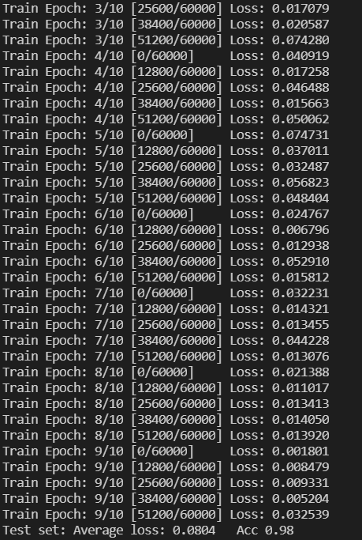

将参数n_epochs 减为5，得到的结果如下:

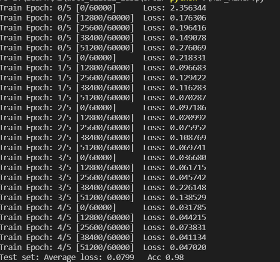

可以看出当epochs=5时模型已经基本收敛，再增加迭代次数也不会使得准确率进一步提升。

此时若将hidden_dim减为50，得到结果为：

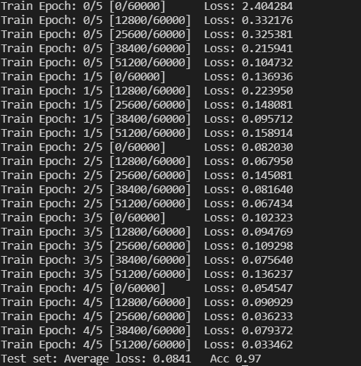

ACC降为0.97，略为降低。

将hidden_dim继续维持在100，将depth进一步增加到10，得到如下结果

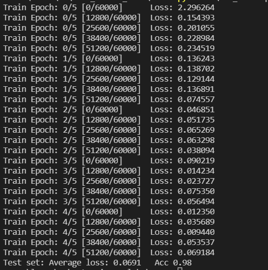

此时再增加depth也不会再增加准确率。

综上可得一组较优的参数:epoch=5,hidden_dim=100,depth=5。此时模型对测试数据的准确率为0.98

